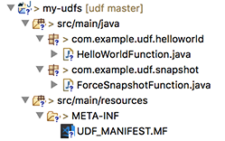
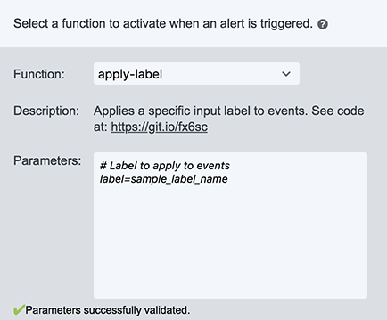
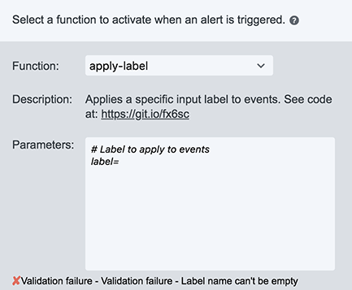
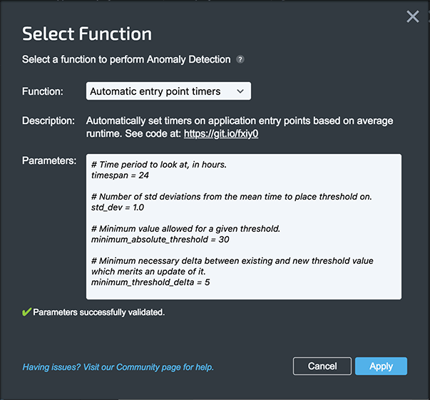

# User Defined Functions

User Defined Functions (UDF) are a simple, flexible mechanism for users to add custom functionality to OverOps. To learn more about UDFs, see: [User Defined Functions (UDF)](https://doc.overops.com/docs/managing-and-creating-alerts#section-user-defined-functions-udf-).

OverOps maintains an [open source UDF library](https://github.com/takipi/overops-functions/) which are automatically enabled for all users.

## Table of Contents

[Background](#background)  
[API Client](#api-client)  
[Getting Started](#getting-started)  
[Required Methods](#required-methods)  
&nbsp;&nbsp;&nbsp;&nbsp; [validateInput](#validateInput)  
&nbsp;&nbsp;&nbsp;&nbsp; [execute](#execute)  
[Optional Methods](#optional-methods)  
&nbsp;&nbsp;&nbsp;&nbsp; [install](#install)  
[Testing](#testing)  
[Building](#building)  
[Manifest](#manifest)  

## Background

This repository contains examples which can be used as a starting point for making custom UDFs that can be uploaded to OverOps as a jar file.

A UDF can be triggered by new events or periodically every 5, 10, 15, 30 or 60 minutes. Upon upload, the jar file is validated and a slim wrapper is injected.

The UDF is executed in a secured environment, independent of our backend. For SaaS, AWS Lambda is used to execute UDFs. On prem, a JVM is spun up and run next to the backend.

## API Client

Since UDFs were designed to be simple and flexible, they're more useful when combined with the OverOps API Client. The [API Client](https://github.com/takipi/api-client) is a simple tool for interacting with the OverOps [public API](https://doc.overops.com/reference) in Java.

The API Client is divided into two projects: the API Client itself, and a set of utility functions. The API Client provides methods for get, put, post, and delete rest operations, as well as POJOs that represent request and result objects for each operation available through the public API. Utility functions wrap commonly used operation sets into a single function.

Let's look at the [list categories](https://doc.overops.com/reference#get_services-env-id-categories) API.

```java
// create a new Builder
ApiClient client = ApiClient.newBuilder()
    .setHostname("http://localhost:8080") // for SaaS, use https://api.overops.com/
    .setApiKey("xxxxxxxxxxx"); // find API token in Account Settings
```

When writing a UDF, we suggest leveraging [ContextArgs](https://github.com/takipi/overops-functions/blob/master/overops-functions/src/main/java/com/takipi/udf/ContextArgs.java), which sets hostname and API key from the context and makes the API Client available.

```java
// from ContextArgs in a UDF
ApiClient apiClient = contextArgs.apiClient();
```

In order to be backwards and forwards compatible with the API, API Client constructors are purposefully not public. Instead, we use Builders. This enables us to be able to change the underlying implementation and add additional functionality in the future without breaking code that depends on API Client.

List categories requires only a service ID:

```java
// in this case, serviceId is the only parameter needed
CategoriesRequest request = CategoriesRequest.newBuilder()
    .setServiceId("Sxxxxx")
    .build();

Response<CategoriesResult> response = client.get(request);

response.isBadResponse(); // helper utilities

CategoriesResult data = response.data;
```

Explore the [OverOps UDF library](https://github.com/takipi/overops-functions/) for more examples on how to use the API Client.

## Getting Started

For convenience, we're using Eclipse and Gradle with the [Gradle Eclipse plugin](https://docs.gradle.org/4.9/userguide/eclipse_plugin.html).

[Fork this project](https://help.github.com/articles/fork-a-repo/), then configure Eclipse:

```console
$ ./gradlew cleanEclipse eclipse

BUILD SUCCESSFUL in 3s
7 actionable tasks: 6 executed, 1 up-to-date
```

Now [import the project into Eclipse](https://www.eclipse.org/community/eclipse_newsletter/2018/february/buildship.php).



This project contains two example functions that can be added to any view: [Hello World](https://github.com/daverted/udf/blob/master/my-udfs/src/main/java/com/example/udf/helloworld/HelloWorldFunction.java) and [Force Snapshot](https://github.com/daverted/udf/blob/master/my-udfs/src/main/java/com/example/udf/snapshot/ForceSnapshotFunction.java). Hello World is identical to [apply-label](https://github.com/takipi/overops-functions/blob/master/overops-functions/src/main/java/com/takipi/udf/label/ApplyLabelFunction.java), which applies a label to each new event. Force Snapshot runs periodically, calling [force snapshot](https://doc.overops.com/v4.28/reference#post_services-env-id-events-event-id-force-snapshot) for every event that has occurred in the last 5 minutes by default.

## Required Methods

Every UDF must have two methods: `validateInput` and `execute`.

### `validateInput`

The `validateInput` method takes a the string `rawInput`, representing parameters, and returns a string if the parameters are valid:

```java
public static String validateInput(String rawInput) {
    return "Valid String";
}
```

The UI displays a success message when `validateInput` returns successfully.



Throw an `IllegalArgumentException` if the parameters are invalid:

```java
throw new IllegalArgumentException("Invalid Parameters");
```

When `validateInput` throws an exception, the UI displays an error containing the detail message.



#### Input Utility

To easily parse parameters, simply extend the class [`com.takipi.udf.input.Input`](https://github.com/takipi/overops-functions/blob/master/overops-functions/src/main/java/com/takipi/udf/input/Input.java).

[comment]: <> (The example below will be updated soon. See https://overopshq.atlassian.net/browse/OO-4754)

For example, the Automatic entry point timers function has four parameters: `timespan`, `std_dev`, `minimum_absolute_threshold`, and `minimum_threshold_delta`.



By [extending `Input`](https://github.com/takipi/overops-functions/blob/master/overops-functions/src/main/java/com/takipi/udf/timer/PeriodicAvgTimerFunction.java#L295), we can easily access these parameters.

```java
static class PeriodicAvgTimerInput extends Input {
    // user defined parameters
    public int timespan;
    public double std_dev;
    public long minimum_absolute_threshold;
    public long minimum_threshold_delta;

    // parse and populate variables
    private PeriodicAvgTimerInput(String raw) {
        super(raw);
    }

    // override toString() to set anomaly function label
    @Override
    public String toString() {
        StringBuilder builder = new StringBuilder();

        builder.append("PeriodicAvgTimer(");
        builder.append(std_dev);
        builder.append(")");

        return builder.toString();
    }

    static PeriodicAvgTimerInput of(String raw) {
        return new PeriodicAvgTimerInput(raw);
    }
}
```

Override the `toString` method to customize anomaly button text.


### `execute`

The `execute` method takes two parameters: `rawInput` and `rawContextArgs`, which are both strings due to the way UDFs are executed in a sandbox environment.

```java
public static void execute(String rawContextArgs, String rawInput)
```

The variable `rawInput` is a string which represents the configuration, the same user parameters passed into our `validateInput` method, which are the same for every execution of the UDF.

The variable `rawContextArgs` is a stringified JSON object which represents the data the UDF is running on.

To easily parse context arguments, leverage [`com.takipi.udf.ContextArgs`](https://github.com/takipi/overops-functions/blob/master/overops-functions/src/main/java/com/takipi/udf/ContextArgs.java).

```java
ContextArgs args = (new Gson()).fromJson(rawContextArgs, ContextArgs.class);
```

Available context arguments are:

```java
public String apiHost;
public String serviceId;
public String eventId;
public String viewId;
public String apiKey;
public String resurface;
```

The `ContextArgs` class also provides convenience utilities for validation and for creating a new API client.

```java
public boolean validate()
public boolean eventValidate()
public boolean viewValidate()
public ApiClient apiClient()
```

Generally the `execute` method will have three parts:

1. validate input parameters
2. get an API client
3. string together API calls to perform desired task

## Optional Methods

### `install`

The optional `install` method is called whenever the user saves the integration. This is useful for retroactively operating on events which have already occurred. The method takes the same `rawContextArgs` and `rawInput` parameters as `execute`.

```java
public static void install(String rawContextArgs, String rawInput)
```

For an example, see the [InfrastructureRoutingFunction](https://github.com/takipi/overops-functions/blob/master/overops-functions/src/main/java/com/takipi/udf/infra/InfrastructureRoutingFunction.java#L60). In this function, the `install` method uses an API client to request all events from the past 30 days and applies infrastructure categorization labels to these events.

## Testing

To test a UDF locally, simply create a `main` method and run it as you would a regular java application.

```java
public static void main(String[] args) {

    // pass API Host, Key, and Service ID as command line arguments
    if ((args == null) || (args.length < 3))
        throw new IllegalArgumentException("java MyFunction API_URL API_KEY SERVICE_ID");

    // create new ContextArgs from command line arguments
    ContextArgs contextArgs = new ContextArgs();

    contextArgs.apiHost = args[0];
    contextArgs.apiKey = args[1];
    contextArgs.serviceId = args[2];

    // get "All Events" view
    SummarizedView view = ViewUtil.getServiceViewByName(contextArgs.apiClient(), contextArgs.serviceId, "All Events");
    contextArgs.viewId = view.id;

    // get an event that has occurred in the last 5 minutes
    DateTime to = DateTime.now();
    DateTime from = to.minusMinutes(5);

    // date parameter must be properly formatted
    DateTimeFormatter fmt = ISODateTimeFormat.dateTime().withZoneUTC();

    // get all events within the date range
    EventsRequest eventsRequest = EventsRequest.newBuilder()
        .setServiceId(contextArgs.serviceId)
        .setViewId(contextArgs.viewId)
        .setFrom(from.toString(fmt))
        .setTo(to.toString(fmt))
        .build();

    // create a new API Client
    ApiClient apiClient = contextArgs.apiClient();

    // execute API GET request
    Response<EventsResult> eventsResponse = apiClient.get(eventsRequest);

    // check for a bad API response
    if (eventsResponse.isBadResponse()) throw new IllegalStateException("Failed getting events.");

    // retrieve event data from the result
    EventsResult eventsResult = eventsResponse.data;

    // exit if there are no events - increase date range if this occurs
    if (CollectionUtil.safeIsEmpty(eventsResult.events)) {
       System.out.println("NO EVENTS");
       return;
    }

    // retrieve a list of events from the result
    List<EventResult> events = eventsResult.events;

    // get the first event
    contextArgs.eventId = events.get(0).id;

    // set label to 'Hello_World_{eventId}'
    String rawInput = "label=Hello_World_" + contextArgs.eventId;

    // convert context args to a JSON string
    String rawContextArgs = new Gson().toJson(contextArgs);

    // execute the UDF
    HelloWorldFunction.execute(rawContextArgs, rawInput);
}
```

## Building

This project depends on [overops-functions](https://github.com/takipi/overops-functions/). First, check out the [overops-functions project](https://github.com/takipi/overops-functions/), then build and install the project locally with:

```console
./gradlew :overops-functions:install
```

To build this project run:

```console
./gradlew clean :my-udfs:fatJar
```

The jar file is created in the `udf/my-udfs/build/libs` folder as `my-udfs-1.0.0.jar`.

Note that the jar file is a "fat jar" -  a jar file which contains all dependencies needed to run it. If the UDF requires a framework or other third party code, all of those class files need to be inside the jar that's uploaded to OverOps. This why even though the UDF code is very simple, the jar files are fairly large. *Avoid a common mistake: build a fat jar, not a regular jar.*

## Manifest

In addition to your custom functions and their dependencies, the jar file uploaded to OverOps must contain the manifest `UDF_MANIFEST.MF`, located in the `resources/META-INF` folder, which contains metadata about your UDFs.

```xml
<?xml version="1.0" encoding="UTF-8"?>
<udf_manifest>
  <version>1.0.2</version>
  <library_name>my-udfs</library_name>
  <backwards_compatible>true</backwards_compatible>
  <functions>
    <function>
      <function_type>ANOMALY</function_type>
      <function_name>Force Snapshot</function_name>
      <description>
        Force a snapshot the next time an event occurs for every event that's occurred in the last few minutes.
      </description>
      <param_type>TEXT</param_type>
      <class_file>com.example.udf.snapshot.ForceSnapshotFunction</class_file>
      <default_params>
        # This function has no parameters.
      </default_params>
      <admin_function>true</admin_function>
    </function>
  </functions>
</udf_manifest>
```

The first three fields: `version`, `library_name`, and `backwards_compatible` describe your UDF library.

The `functions` field contains individual `function` entries for each UDF in your library. A `function` contains the following fields:

* `function_type`
  * `CHANNEL`: functions that are triggered by new events
  * `ANOMALY`: functions that are triggered periodically
* `function_name`
  * The function name
  * Must be unique inside the manifest
  * Whenever a user re-uploads a file, each function's implementation can be changed, but the name must remain the same. This is how we know which UDF to call.
* `description`
  * Description text displayed in the UI
* `param_type`
  * currently must be `TEXT`
* `class_file`
  * The fully qualified name of the class to execute
  * Must have `validateInput` and `execute` methods
* `default_params`
  * default parameters that appear in the UI
* `admin_function`
  * hides the function from the dropdown menu if not an admin
  * this is not a security feature, it's only a way to avoid clutter in the UI

*Tip: You may use the same `class_file` with a different `function_name` and `default_params` to produce multiple UDFs from the same class.*
